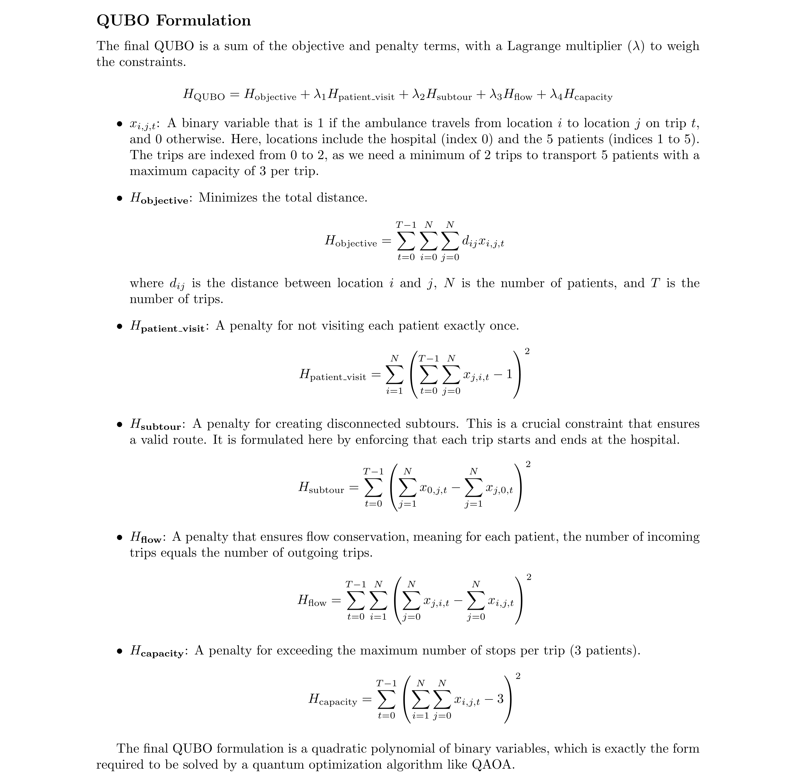

#  Smart Traffic Optimization in the New Capital

## Problem Description
Efficient traffic management in new cities is not just about reducing congestion, it directly affects sustainability, fuel-efficient driving, and the quality of everyday life. For residents, smooth traffic means less time spent commuting, lower stress, and more time for work, family, and personal pursuits.

In emergency medical situations, the stakes are even higher: every second saved in ambulance travel can mean saving a life. Effective route optimization in such scenarios ensures that patients reach hospitals quickly, directly supporting the UN Sustainable Development Goals (SDGs):

SDG 3 – Good Health and Well-Being, by ensuring timely access to healthcare.

SDG 11 – Sustainable Cities and Communities, through smarter, safer urban mobility.

SDG 13 – Climate Action, by reducing fuel consumption and emissions through optimized travel.

### Scenario: Emergency Patient Transportation
You are tasked with transporting **5 patients** to a central hospital using **1 ambulance**.

#### Constraints
- The ambulance can make **multiple trips**.
- Each trip can include **at most 3 patients**.
- **All patients must eventually reach the hospital**.

#### Objective
Find ambulance routes that **minimize the total travel distance** while ensuring all patients are transported.

#### Data
- Input file: [`OptimizationProblemData.json`](https://drive.google.com/file/d/1XVoEXkX3xfltEsoP1O_Oyi6IdpDJe_ez/view?usp=sharing)
- Contains:
  - Hospital location (latitude/longitude)
  - Patient locations (latitude/longitude)
- Distances are computed using **real GPS coordinates**.


---

##  Classical Approach
The classical solution uses:
- **OSMnx** and **NetworkX** for road network extraction and routing.
- **Geopy** for geographic distance calculations.
- **Greedy and brute-force search** strategies to explore possible ambulance trips.

Classical algorithms can solve this problem for **5 patients**, but as the number of patients grows, the number of possible route combinations increases **exponentially**.  
This makes classical approaches computationally expensive.

---

##  Quantum Approach
To scale beyond small instances, we reformulate the routing problem as a **Quadratic Unconstrained Binary Optimization (QUBO)** problem.

### QUBO Formulation


---

### Qiskit Implementation

We encode the above into a `QuadraticProgram` and convert it to QUBO with  
`QuadraticProgramToQubo()`. The QUBO is solved using **QAOA** (Check prerequisites/fully\_quantum\_approach.py)

### Variable Reduction

The model requires **30 qubits**.
To make execution feasible:

* We **drop the stop dimension** inside the binary variables:

  $x_{i,j,t} \;\mapsto\; y_{i,t}$

  reducing #qubits from $30 \to 10$.
* A **classical post-processing layer** filters out invalid assignments

This hybrid scheme balances **quantum search** with **classical validation**, making it more scalable.


### Why Quantum?
*REVIEW: Needs revision — the original claim about "parallel" exploration and guaranteed speedups is misleading.*

~~Classical solvers must check each possible route partition, which grows combinatorially.~~
~~Quantum optimization algorithms (e.g., **QAOA**, **Quantum Annealing**) can explore many route combinations **in parallel**, offering potential speedups.~~

---

##  Repository Structure
```bash
.
├── LICENSE
├── notebooks
│   ├── classical_routing_optimization.ipynb
│   ├── OptimizationProblemData.json
│   ├── quantum_solution.ipynb
│   ├── requirements_classic.txt
│   └── requirements_quantum.txt
├── prerequisites
│   ├── Best__Route_bet_two_corrdinates.ipynb
│   ├── Full_Route_Between_two_coordinates.ipynb
│   └── fully_quantum_approach.py
├── quantum_statistics
│   ├── quantum_solution.ipynb
│   └── solutions.json
├── README.md
├── Smart Traffic Optimization In the New Capital.pptx
└── Technical_Report.pdf

```


